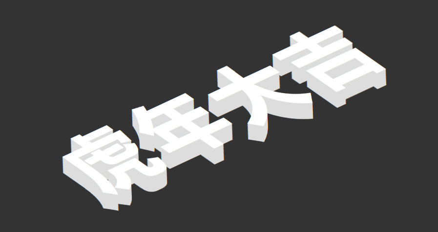

# html网页赏析
#### 水滴效果样式赏析 

从总体而言 这个css样式通过对问元素和过渡效果的运用 很好的完成了一个水滴效果的botton样式 
```
background-image: linear-gradient(to top, #e6e9f0 0%, #eef1f5 100%);
```
`background-image`属性设置了水滴的渐变色,`linear-gradient`创建了一个线性渐变,`to top`属性设置了渐变方向,`#e6e9f0`和`#eef1f5`分别设置了渐变的起始和结束颜色.
```
.button:focus {
        color: white;
}
.button:focus:after {
    transform: none;
    background-color: rgba(0, 0, 255, 0.75);
}
```
此处定义的是实现鼠标悬停时的样式,主要效果是将文本颜色设置为白色,并将水滴的背景色设置为透明度为0.75的蓝色.

无论是有序的代码风格,还是达到的优雅效果,都是值得学习的


#### 2.5D立体文字效果
主要观察其css文件 我们可以观察到
```
justify-content: center;
align-items: center;
background-color: #333;
```
justify-content 和 align-items 分别实现了水平居中和垂直居中
而同样是使用back-ground-color属性设置了背景色为黑色
通过分析,不难得到其核心代码
```
    /* 设置旋转角度和倾斜角度 */
    transform: rotate(-25deg) skew(30deg);
    /* 字体阴影(立体厚度) */
    text-shadow: -1px 1px 0 #ddd,
    -2px 2px 0 #ddd,
    -3px 3px 0 #ddd,
    -4px 4px 0 #ddd,
    -5px 5px 0 #ddd,
    -6px 6px 0 #ddd,
    -7px 7px 0 #ddd,
    -8px 8px 0 #ddd,
    -9px 9px 0 #ddd,
    -10px 10px 0 #ddd,
    -11px 11px 0 #ddd,
    -12px 12px 0 #ddd,
    -13px 13px 0 #ddd,
    -14px 14px 0 #ddd,
    -15px 15px 0 #ddd,
    -16px 16px 0 #ddd,
    -17px 17px 0 #ddd,
    -18px 18px 0 #ddd,
    -19px 19px 0 #ddd,
    -20px 20px 0 #ddd;
```
就是介个
其中rotate元素用于设置旋转 skew用于设置倾斜
令人钦佩的是,原作者通过手动多次指定不同偏移量的阴影,实现了立体感和深度感,但其实应该有更加优美而简介的写法
最后来看看结果

### 文本背景扫光效果
可以注意到的是,此网页主要重在css样式的编码,其中同样使用了弹性布局的水平垂直居中
重点来看看他定义的h1标签的样式
```
h1{
    /* 文本透明 */
    color: transparent;
    font-size: 60px;
    letter-spacing: 5px;
    /* 渐变背景 */
    background: linear-gradient(to right,#000,#fff,#000);
    /* 裁剪掉文字以外的区域 */
    -webkit-background-clip: text;
    background-size: 80%;
    background-repeat: no-repeat;
    background-position: center;
    /* 执行动画:动画名 时长 线性 无线播放 */
    animation: move 2s linear infinite;
}
```
```
    animation: move 2s linear infinite;
```
重点是这一句
将其注释后可以发现 原先的滚动扫光动画效果消失了,此处为实现该样式的核心代码
通过查阅资料 @keyframes 起到一种类似关键帧的效果,即动画不同阶段的效果
此处贴出全部代码,实现效果的原理也就明了了
```
    @keyframes move {
    0%{
        background-position: -500%;
    }
    100%{
        background-position: 500%;
    }
}
```
这里是具体效果图

#### loading加载特效
先给出预览图吧,方便进行进一步的赏析

html代码中span作为一个内联元素很好的参与了整个样式的构建,除此之外并没有其他有意义的内容,直接快进到css部分
```
@keyframes move {
    0%{
        right: 0;
        opacity: 0;
    }
    35%{
        right: 41%;
        transform: rotate(0deg);
        opacity: 1;
    }
    65%{
        right: 59%;
        transform: rotate(0deg);
        opacity: 1;
    }
    100%{
        right: 100%;
        transform: rotate(-180deg);
        opacity: 0;
    }
}
```
同样出现了刚才的@keyframes 关键帧动画,这里是实现loading加载特效的核心代码
rotate作为旋转刚才也有提及 opacity则是作为透明度的设置
span元素设置了一个animation效果
```
    animation: move 2.5s linear infinite;
```
linear 即动画的线性,infinite 代表无限循环
使用了一个span::after的伪元素,其中可以看到一个新内容
```
    filter: blur(1.5px);
```
具体实现的效果就是增添了一个模糊滤镜,使得loading加载特效更加生动

```
.loader span:nth-child(2){
    animation-delay: 0.2s;
}
.loader span:nth-child(3){
    animation-delay: 0.4s;
}
.loader span:nth-child(4){
    animation-delay: 0.6s;
}
.loader span:nth-child(5){
    animation-delay: 0.8s;
}
.loader span:nth-child(6){
    animation-delay: 1s;
}
.loader span:nth-child(7){
    animation-delay: 1.2s;
}
.loader span:nth-child(8){
    animation-delay: 1.4s;
}
.loader span:nth-child(9){
    animation-delay: 1.6s;
}
.loader span:nth-child(10){
    animation-delay: 1.8s;
}
.loader span:nth-child(8)::before,
.loader span:nth-child(9)::before,
.loader span:nth-child(10)::before{
    content: "";
    position: absolute;
    left: 0;
    bottom: 13px;
    width: 30px;
    height: 30px;
    border-radius: 50%;
    background-color: red;
}
.loader span:nth-child(8)::before{
    background-color: #eccc68;
}
.loader span:nth-child(9)::before{
    background-color: #7bed9f;
}
.loader span:nth-child(10)::before{
    background-color: #ff6b81;
}
```
#### 高光卡片
直接快进到css部分
已经解释出现过的内容由于篇幅问题不在提及 直接来看核心代码
```
.card:hover::before{
    opacity: 0.6;
    transform: rotateX(7deg) translateY(-6px) scale(1.05);
}
```
此处是鼠标焦点聚焦时出现的动画效果 透明度变换,x轴旋转,y轴位移,略微放大
实现出来的即是这个效果

## 总结
通过这次的赏析,不仅学习到了关键帧动画效果的使用,更为重要的是了解了css样式的编写技巧,以及不同效果的实现原理,这对于我们日常的css编写工作有着很大的帮助